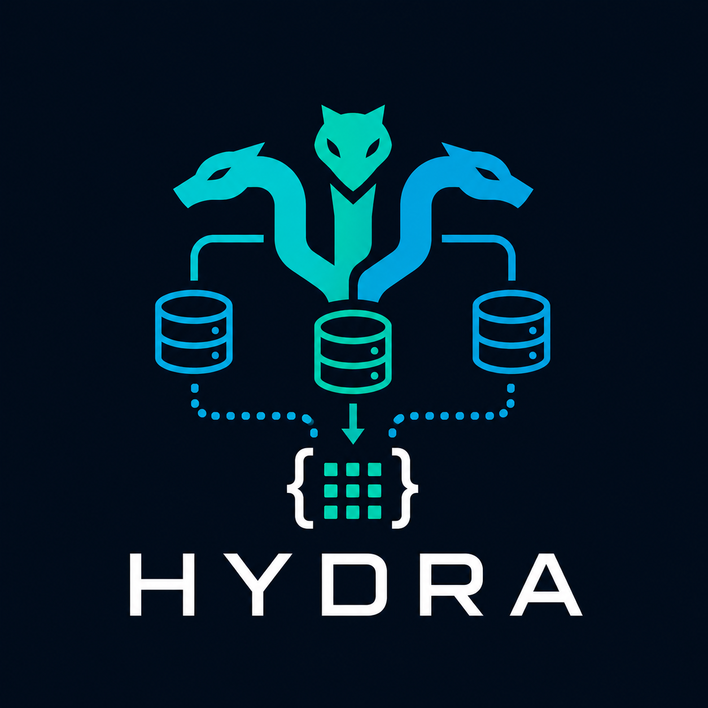

# Sphire Hydra

[](https://github.com/sphireinc/Hydra/actions/workflows/build.yml)
[](https://sphireinc.github.io/Hydra/)
[](https://github.com/sphireinc/Hydra/releases/latest)
[](https://github.com/sphireinc/Hydra/releases/latest)
[](https://github.com/sphireinc/Hydra/releases/latest)
[](https://github.com/sphireinc/Hydra/releases/latest)

<div align="center">
  
</div>

Sphire Hydra is a Go library for hydrating Go structs from database rows using reflection and `hydra` tags.

It supports:

- MySQL
- MariaDB
- SQLite
- PostgreSQL
- CockroachDB
- Microsoft SQL Server
- Oracle

> [!WARNING]
> Hydra is still a small and evolving project. Treat the API as stabilizing rather than fully mature.

## Installation

```bash
go get github.com/sphireinc/Hydra
```

## Quick start

```go
package main

import (
	"database/sql"
	"errors"
	"fmt"
	"log"

	"github.com/sphireinc/Hydra/hydra"
	_ "github.com/mattn/go-sqlite3"
)

type Person struct {
	ID    int    `hydra:"id,pk"`
	Email string `hydra:"email,lookup"`
	Name  string `hydra:"name"`

	hydra.Hydratable
}

func (Person) HydraTableName() string {
	return "person"
}

func main() {
	db, err := sql.Open("sqlite3", ":memory:")
	if err != nil {
		log.Fatal(err)
	}
	defer db.Close()

	_, err = db.Exec(`
		CREATE TABLE person (
			id INTEGER PRIMARY KEY,
			email TEXT NOT NULL,
			name TEXT NOT NULL
		);

		INSERT INTO person (id, email, name)
		VALUES (1, 'alice@example.com', 'Alice');
	`)
	if err != nil {
		log.Fatal(err)
	}

	person := &Person{}
	person.Init(person)
	person.XDBTypeOverride = "sqlite"

	if err := person.HydrateByPrimaryKey(db, 1); err != nil {
		log.Fatal(err)
	}

	fmt.Printf("loaded by pk: %+v\n", person)

	byEmail := &Person{
		Email: "alice@example.com",
	}
	byEmail.Init(byEmail)
	byEmail.XDBTypeOverride = "sqlite"

	if err := byEmail.HydrateByLookup(db); err != nil {
		if errors.Is(err, hydra.ErrNotFound) {
			log.Fatal("row not found")
		}
		log.Fatal(err)
	}

	fmt.Printf("loaded by lookup: %+v\n", byEmail)
}
```

## Contract

### Initialization

Hydra requires an addressable struct pointer.

Use:

```go
p := &Person{}
p.Init(p)
```

Do not rely on calling Init on a non-pointer struct value.

### Table name resolution

Hydra resolves the table name in this order:
1. Hydratable.XTableNameOverride
2. HydraTableName() string on the struct
3. lowercase struct type name

Example:

```go 
type Person struct {
ID int `hydra:"id,pk"`
hydra.Hydratable
}

func (Person) HydraTableName() string {
return "people"
}
```

### Database handle types

Hydra currently supports these handle types:
- *sql.DB
- MySQL
- MariaDB
- SQLite
- MSSQL
- Oracle
- *pgx.Conn
- PostgreSQL
- CockroachDB

Database routing is controlled by XDBTypeOverride.

Examples:

```go
obj.XDBTypeOverride = "sqlite"
obj.XDBTypeOverride = "mysql"
obj.XDBTypeOverride = "postgres"
obj.XDBTypeOverride = "cockroachdb"
```

### No rows

If no row matches, Hydra returns:

```go
hydra.ErrNotFound
```

Hydra does not silently leaves the struct at zero values (earlier versions of Hydra did)

### Empty where clauses

If hydration is attempted with an empty where map, Hydra returns:

```go
hydra.ErrEmptyWhereClause
```

### Identifier safety

Hydra validates table names and column names before building SQL.

Only simple identifiers are allowed:
- letters
- numbers
- underscore
- must not start with a number

This intentionally rejects raw SQL fragments in identifiers.

## Tags

### Basic column mapping

```go
type Person struct {
	ID    int    `hydra:"id"`
	Name  string `hydra:"name"`
	Email string `hydra:"email"`
	hydra.Hydratable
}
```

### Primary key tags

Use pk to mark the field used by `HydrateByPrimaryKey(...)`

```go
type Person struct {
	ID int `hydra:"id,pk"`
	hydra.Hydratable
}
```

### Lookup tags

Use lookup for fields that should be used by `HydrateByLookup()`

```go
type Person struct {
	Email string `hydra:"email,lookup"`
	hydra.Hydratable
}
```

## Supported field assignment behavior

Hydra supports these built-in conversions:
- string from string or []byte
- bool from bool, numeric values, "true" / "false", or byte equivalents
- signed integers from common numeric values and parseable strings/bytes
- unsigned integers from common numeric values and parseable strings/bytes
- floats from numeric values and parseable strings/bytes
- pointers to supported destination types
- interfaces
- direct assignable / convertible values for matching struct, slice, array, or map types

NULL values are supported for:
- pointers
- slices
- maps
- interfaces

NULL into non-nullable concrete value fields returns an error.

## Custom field converters

Hydra supports two converter styles.

### Field-level converter

Implement `HydraConvert(src any) error`

Exaple:

```go
type RFC3339Time struct {
	time.Time
}

func (t *RFC3339Time) HydraConvert(src any) error {
	switch v := src.(type) {
	case string:
		parsed, err := time.Parse(time.RFC3339, v)
		if err != nil {
			return err
		}
		t.Time = parsed
		return nil
	case []byte:
		parsed, err := time.Parse(time.RFC3339, string(v))
		if err != nil {
			return err
		}
		t.Time = parsed
		return nil
	default:
		return fmt.Errorf("unsupported time input %T", src)
	}
}
```

### Parent-level converters

Implement `HydraConverters() map[string]hydra.HydraFieldConverter`

Keys can be either:
- field name
- column name

## Context-aware APIs

Hydra supports context-aware calls:
- `HydrateContext(ctx, db, whereClauses)`
- `HydrateByPrimaryKeyContext(ctx, db, value)`
- `HydrateByLookupContext(ctx, db)`
- `FetchContext(ctx, db, tableName, columns, whereClauses)`

Use these when cancellation or deadlines matter.

## Example patterns

### Hydrate with explicit where clauses

```go
person := &Person{}
person.Init(person)
person.XDBTypeOverride = "sqlite"

err := person.Hydrate(db, map[string]interface{}{
	"id": 1,
})
```

### Hydrate by primary key

```go
person := &Person{}
person.Init(person)
person.XDBTypeOverride = "sqlite"

err := person.HydrateByPrimaryKey(db, 1)
```

### Hydrate by lookup field

```go
person := &Person{
	Email: "alice@example.com",
}
person.Init(person)
person.XDBTypeOverride = "sqlite"

err := person.HydrateByLookup(db)
```

## Functional test workflow

Fast local/unit checks:

```bash
make test
make test-hydra
```

Full Docker-backed functional suite:

```bash
make test-func
```

Or directly:

```bash
docker compose -f functional_tests/docker-compose.yml up --build --abort-on-container-exit --exit-code-from test-runner
```

## Contributing

Contributions are welcome. Please run the relevant test targets before opening a PR.

